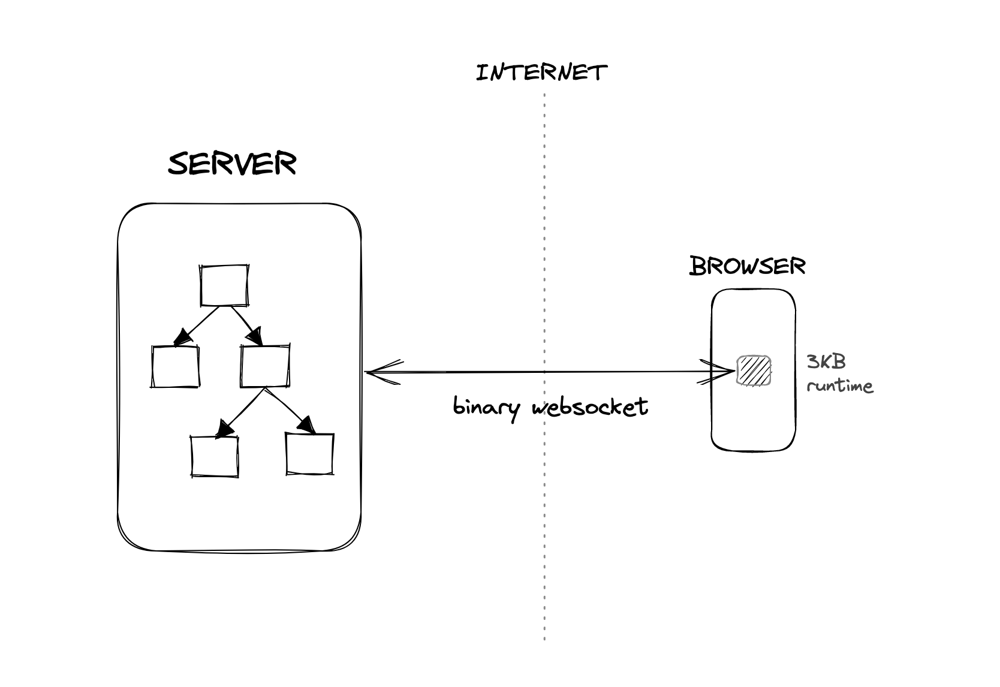

# Seniman

Seniman is a Node.JS web framework that enables your UI components to run on the server; synchronizing the latest UI state with the browser using custom binary protocol over WebSocket and a thin ~2KB browser runtime. Seniman uses familiar JSX syntax & state management APIs so you hit the ground running.

```js
import { useState } from "seniman";

function Counter(props) {
  let [getCount, setCount] = useState(0);
  let onClick = () => setCount(count => count + 1);

  return <div class="counter">
    My counter: {getCount()}
    <button onClick={onClick}>Add +</button>
  </div>;
}
```

## Table of Contents
- [How it Works](#how-it-works)
- [Installation](#installation)
- [Basic Usage](#basic-usage)
- [FAQ](#faq)

## How it Works

At a high-level, Seniman runtime is divided into two parts: the server, and client-side runtimes. Here's how the rough architecture looks like:



On the server-side, Seniman includes a custom runtime to build and maintain your UI's component tree, track state changes across components, and manage connections to concurrently-connected browser windows. The server-side runtime is also responsible for generating UI update commands to make sure the browser is able to render the latest UI state.

In order to achieve network efficiency, Seniman sends its update commands over a custom binary protocol over WebSocket, which are then interpreted into actual DOM operations by a ~2kb browser runtime. The result is a low-latency, fast-loading, remotely-driven user interface that feels local over a normal 4G connection.

## Installation

To use Seniman, the packages you need to install are Seniman itself, and the Babel plugin that will transform your Seniman JSX code.

Run the following command to install Seniman:
```sh
npm install seniman
```

And the following for the Babel plugin:

```sh
npm install --save-dev babel-plugin-seniman
```

## Basic Usage

To start off simple, let's create a simple `Hello World` component. Create a new file called `src/index.js` with the following contents:

```js
import { useState } from "seniman";
import { createServer } from "seniman/server";

function HelloWorld(props) {
  let [getCount, setCount] = useState(0);
  let onClick = () => setCount(count => count + 1);

  return <div class="hello-world">
    Hello World! {getCount()}
    <button onClick={onClick}>Add +</button>
  </div>;
}

let server = createServer({Body: HelloWorld});

server.listen(3002);

```

To set up Seniman, you need to configure Babel to use the Seniman plugin. You can do this by adding the following to your `babel.config.json` file:

```json
{
  "plugins": ["seniman"]
}
```

Then, you can run the babel compiler-watcher by running `babel` through `npx`:

```sh
npx babel src --out-dir dist --watch
```

This will watch your `src` directory for changes, and compile them to the `dist` directory. You can then run your code using Node.js:

```sh
node dist/index.js
```

Open up your browser and navigate to `http://localhost:3002`, and you should see a counter that increments when you click the button.

## FAQ

### I have some logic I need running on the client. How do I do that?

While most UI patterns are entirely implementable server-side with Seniman, Seniman also supports running custom logic on the client. Things that naturally need to run on the client like Google Single Sign-On, or custom analytics can be implemented using the `$c` and `$s` syntax.

### This looks pretty stateful -- what happens when a client loses its connection to the server, or a server goes down?

Seniman is designed to be resilient to network failures. When a client loses its connection to the server, the client will automatically execute connection retries -- and upon reconnection to the existing window session, the server will re-stream the command buffers that are not yet acknowledged by the client, getting the client up to speed with the latest state.

When a server goes down, the client will similarly automatically reconnect to a different server in the cluster -- albeit restarting the session and losing any state that is not persisted to a database. If there is any important UI state you cannot afford to lose to a server crash -- say, a long, multi-input form -- you can persist the state to a database and re-load it when the client reconnects to a different window.

### This looks pretty stateful -- do I get to deploy this normally?

Seniman can be deployed like any other Node.JS application. You can use a process manager like PM2 to manage your Seniman processes, and a reverse proxy like Nginx to load balance your Seniman instances.

In order for your users to have better experience during network reconnection, however, it is recommended to set up client-IP sticky sessions in your reverse proxy. This will help ensure that a client that has disconnected, will reconnect to the same server instance when it comes back online, allowing the client to resume its session without losing any state.

### Any example of this framework running somewhere?

Yes -- the documentation site for Seniman is built using Seniman itself! You can access the (currently in-development) site at [seniman.space](https://seniman.space).

### Is my actual component code downloaded to the client?

No, only the resulting DOM operations are sent to the client -- your component code is never downloaded to the client. This  means you can safely implement sensitive logic (like loading data from a database) or use sensitive data (like secret tokens) within the component code.